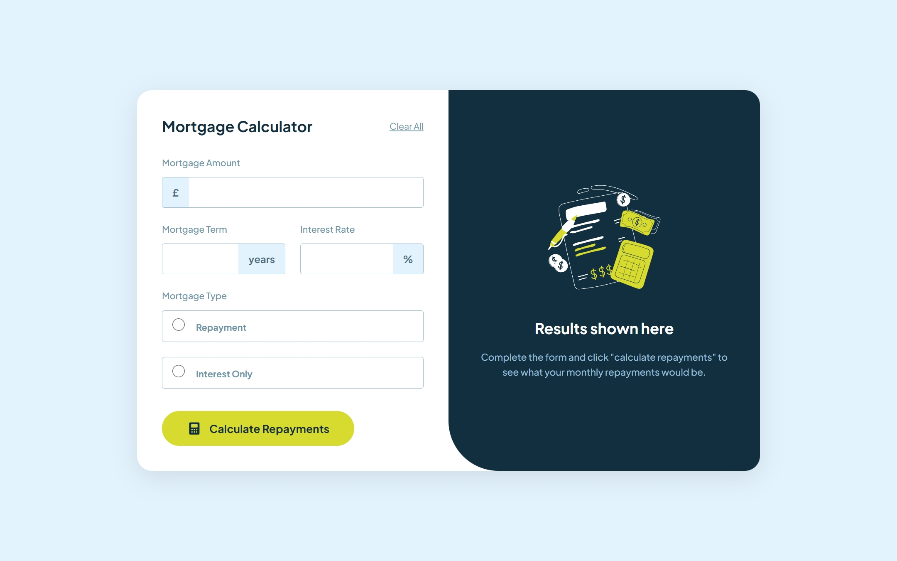
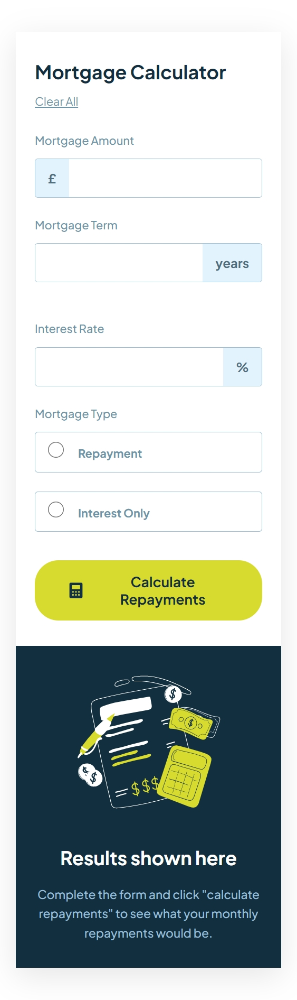
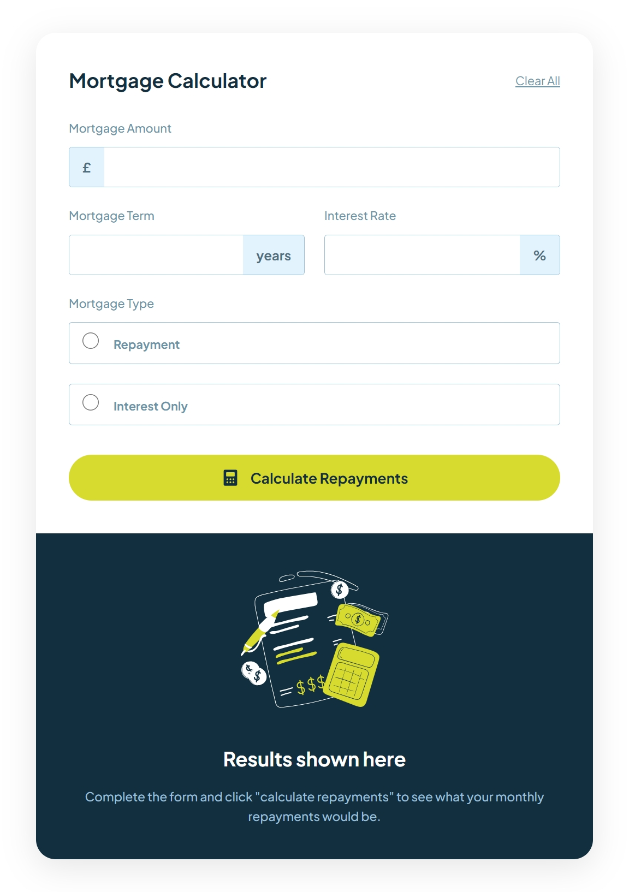

# Frontend Mentor - Mortgage Repayment Calculator


## Welcome! 👋

This is a solution to the [Mortgage repayment calculator challenge on Frontend Mentor](https://www.frontendmentor.io/challenges/mortgage-repayment-calculator-Galx1LXK73).

## Table of Contents

- [Overview](#overview)
  - [The Challenge](#the-challenge)
  - [Key Features](#key-features)
  - [Screenshots](#screenshots)
  - [Links](#links)
- [My Process](#my-process)
  - [Built With](#built-with)
  - [What I Learned](#what-i-learned)
  - [Accessibility & UX](#accessibility--ux)
- [Getting Started](#getting-started)
  - [Installation](#installation)
  - [Usage](#usage)
- [PWA Support](#pwa-support)
- [Author](#author)

## Overview

The Mortgage Repayment Calculator is a high-performance web tool designed to help users quickly estimate their financial commitments. Built with a focus on speed, clarity, and accessibility, this application provides an interactive experience that works seamlessly across all devices. By leveraging Progressive Web App (PWA) technology, users can install the tool directly for instant offline access.

### The Challenge

Users should be able to:

- Input mortgage amount, term, interest rate, and type.
- View calculated monthly and total repayments.
- See form validation errors if fields are empty or invalid.
- Clear the form and results with a single click.
- Experience a fully responsive layout.
- Install the app on mobile devices as a Progressive Web App (PWA).

### Key Features

- **Interactive Calculations**: Real-time results for both Repayment and Interest-Only mortgages.
- **Improved Data Entry**: Automated thousand separators (commas) for the mortgage amount field.
- **Modern Responsive Design**: Centered layout with smooth transitions between mobile, tablet, and desktop views.
- **Accessibility (A11y)**: ARIA live regions ensure screen readers announce results instantly upon calculation.
- **Progressive Web App**: Installable on iOS/Android for a native-like experience.

### Screenshots

| 
|  
|  |

### Links

- Solution URL: [GitHub Repository](https://github.com/MhistaFortune/mortgage-calculator-app)
- Live Site URL: [Vercel Demo](https://mortgage-calculator-app-six.vercel.app/)

## My Process

### Built With

- **React 19** - UI Framework
- **TypeScript** - For type-safe development
- **Vite 7** - Lightning-fast build tool
- **CSS3** - Custom properties and Flexbox/Grid for layout
- **Vite PWA Plugin** - For service worker and manifest generation
- **Intl.NumberFormat** - For localized number formatting

### What I Learned

One of the highlights was implementing a custom formatter for the mortgage amount that inserts commas as you type, without breaking the underlying decimal logic:

```typescript
const formatNumber = (value: string) => {
  if (!value) return '';
  const parts = value.split('.');
  parts[0] = new Intl.NumberFormat('en-GB').format(Number(parts[0].replace(/,/g, '')));
  return parts.join('.');
};
```

### Accessibility & UX

To make the app "top notch," I focused on:
1. **ARIA Live Regions**: Used `aria-live="polite"` so screen readers announce results without the user having to manually find them.
2. **Semantic HTML**: Proper use of `<main>`, `<section>`, and `<header>` for better structure.
3. **PWA Integration**: Enabling users to keep the tool on their home screen for easy access.

## Getting Started

### Installation

1. Clone the repository:
   ```bash
   git clone https://github.com/Mhista-Fortune/Mortgage-Calculator.git
   ```
2. Install dependencies:
   ```bash
   npm install
   ```
3. Run the development server:
   ```bash
   npm run dev
   ```

### Usage

- **Mortgage Amount**: Enter the total loan amount (commas are added automatically).
- **Mortgage Term**: Enter the duration in years.
- **Interest Rate**: Enter the annual percentage rate (APR).
- **Mortgage Type**: Select between "Repayment" (principal + interest) or "Interest Only".
- **Calculate**: Click to see your results announced and displayed.

## PWA Support

The app is fully installable! 
- **iOS**: Tap "Share" and "Add to Home Screen".
- **Android**: Tap the "Add to Home Screen" prompt or the three-dot menu in Chrome.

## Author

- Website - [Mhista Fortune](https://mortgage-calculator-web-app.netlify.app/)
- Frontend Mentor - [@Mhista-Fortune](https://www.frontendmentor.io/profile/Mhista-Fortune)